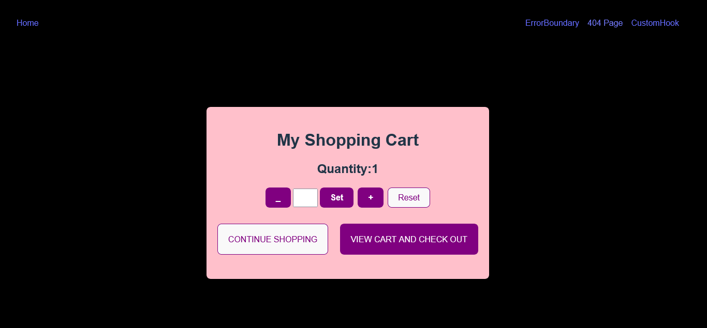

## My Alt-school Counter Exam Project. Setup a custom counter hook with increment, decrement, reset, setValue functions with a valid UI and Implement a combination of states with a useReducer that implements a counter with the four evident features in the custom hook -  increment, decrement, reset, setValue. Implement a page for the custom hook, useReducer, 404, and a page to test error boundary and good SEO.

#### Hosted Link 
[Live site](https://my-exam-project.vercel.app/)

#### Screenshots

